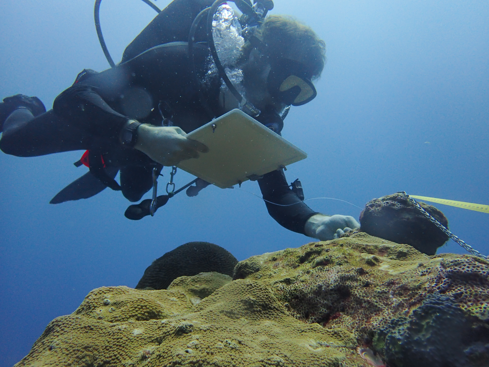

---
output:
  html_document:
    fig_height: 5
    fig_width: 5
    fig_position: center
  always_allow_html: true
  word_document: default
editor_options: 
  chunk_output_type: console
---

<h1 style="color: darkblue;font size=24, align=center" > National Coral Reef Monitoring Program</h1> 

<h2 style="color: darkblue;font size=12"> Climate Monitoring Brief: Flower Garden Banks National Marine Sanctuary</h2>
--------


```{r setup, include=FALSE}
knitr::opts_chunk$set(echo = FALSE,
                message = FALSE, warning = FALSE, 
                fig.align = "center")
options(htmltools.dir.version = FALSE)
```

 
```{r libraries, include=FALSE}
library(dplyr)
library(reshape)
library(tidyverse)
library(lubridate)
library(stringr)
library(fs)

library(plotly)
library(scales)
library(ggpubr)
library(RColorBrewer)
library(scales)
library(openair)
library(magick)
library(ggplot2)
library(cowplot)

library(knitr)
```


```{r front, echo=FALSE, out.width = '75%', fig.cap="Coral reef at East Buoy 3 in the Flower Garden Banks", fig.align='center'}

knitr::include_graphics("Pictures/Top_1.jpg")

```

<br>

<h4 style="font size=8">
Atlantic Oceanographic &amp; Meteorological Laboratory Coral Program<br>
University of Miami Cooperative Institute of Marine and Atmospheric Science<br>
National Oceanic and Atmospheric Administration</h4>

<br>

<h5 style="font size=6">
N. Besemer, A. Palacio, B. Ross, I. Enochs - February 2026
</h5>

```{r logos, echo=FALSE, fig.align='left', out.width='20%'}
p1 <- ggdraw() + draw_image("Logos/NOAA.jpg", scale = 0.7)
p2 <- ggdraw() + draw_image("Logos/UM.png", scale = 0.9)

plot_grid(p1, p2)
```

--------

### Mission

The AOML Coral Program tracks the status and trends of coral reef ecosystems of the U.S. Atlantic and Caribbean as part of the National Coral Reef Monitoring Program (NCRMP). This summary brief provides an overview of the most recent climate monitoring efforts at Flower Garden Banks National Marine Sanctuary (FGBNMS).


### Expedition summary

* The AOML Coral Program conducted NCRMP climate monitoring operations at FGBNMS from August 25th to August 29th, 2025

* A total of eight different sites were visited by ten team members and local sanctuary collaborators, completing a total of 39 dives. 

--------

### Data collection summary

```{r get Temp, include=FALSE}
# 1. Import all processed temperature data
read_plus <- function(flnm) {
  read_csv(flnm ) %>%
    mutate(filename = flnm)
}

tbl_with_sources <-
    list.files(pattern = "*.csv", 
               full.names = T) %>% 
    map_df(~read_plus(.))

STR_all <-
    list.files(path = "Data/STRs",
               pattern = "*.csv", 
               full.names = T, 
               recursive = TRUE) %>% 
    map_df(~read_plus(.)) 


STR_all <- STR_all %>%
      mutate_at("filename", str_replace, "Data/STRs/FGB_", "")

colmn<-c("Transect", "Depth", "SN")
STR_all <-
  tidyr::separate(
    data = STR_all,
    col = filename,
    sep = "_",
    into = colmn,
    remove = TRUE
  )


## Formatting
summary(STR_all$Depth)
STR_all$Depth<-as.factor(STR_all$Depth)
#STR_all$Depth[STR_all$Depth=="20m"]<-"20m"
# STR_all$Depth[STR_all$Depth=="25m"]<-"25m" # 24m changed to 25 to plot easier
# STR_all$Depth[STR_all$Depth=="30m"]<-"30m" # 27m changed to 30 to plot easier
# STR_all$Depth[STR_all$Depth=="35m"]<-"35m" # 38m changed to 35 to plot easier
STR_all$Depth<-factor(STR_all$Depth, 
                levels = c("20m", "25m", "30m","35m"))
summary(STR_all$Depth)


STR_all$Transect[STR_all$Transect=="FGB E Bank"]<-"East"
STR_all$Transect[STR_all$Transect=="FGB W Bank"]<-"West"
STR_all$Transect<-factor(STR_all$Transect, 
                levels = c("East","West"))
summary(STR_all$Transect)
```

**Subsurface temperature** 

Subsurface temperature recorders (STRs) were recovered and redeployed at east and west bank transects, including four instruments per bank ranging in depth from 20m to 35m  (Fig. 1). In total, more than 1.5 million temperature observations were collected (Table 1).
  
```{r Temp observations}
Cases_Loc_depth<-STR_all %>% count(Depth, Transect,
                                  sort = FALSE)
Cases_Loc_depth<-as.data.frame(Cases_Loc_depth %>%
                   pivot_wider(names_from = Depth,
                   values_from = n))
Cases_Loc_depth$Total<-rowSums(Cases_Loc_depth[, c(2:5)], na.rm=TRUE)

kable(Cases_Loc_depth,
      format.args = list(big.mark = ","),
      caption = "Table 1: Number of temperature observations collected by transect and depth")

```


```{r map, echo=FALSE, out.width = '50%', fig.cap="Figure 1: Study sites and depths in Flower Garden Banks", fig.align='center'}

knitr::include_graphics("Pictures/fgb_sitemap.jpg")

```


```{r sami_ph_data, include=FALSE}

# Load the SAMI data
pH <- read_csv('Data/Sentinel/SAMI_P0317_290825_out.xlsx', col_types = cols()) %>%
  
  # Combine Date + Time → DateTime
  mutate(
    DateTime = parse_date_time(
      paste(Date, Time), 
      orders = c("Y-m-d H:M:S")),
    DateTime = with_tz(DateTime, "America/Chicago")) %>%
  
  # Rename columns to match your workflow style
  select(
    DateTime,
    pH = SAMIpH,
    Temperature = TempC) %>%
  
  # OPTIONAL: filter monitoring window (change as needed)
    #manual start/stop time of monitoring
   filter(DateTime >= as.POSIXct('2025-08-26 08:30:00', tz='America/Chicago') &
          DateTime <= as.POSIXct('2025-08-29 07:45:00', tz='America/Chicago')) %>%
  
  # Print summary
  glimpse()

```


```{r Current_data, include=FALSE}
# 2. Get current data
fileAny <- "Data/Sentinel/tilt-sn2102061-fgb-suite.csv"
  # Are there going to be more than one current file? 
  current <- read.csv(fileAny, header = TRUE)
  summary(current)
  head(current)
  current$Date<-as.Date(current$Date, format = "%Y-%m-%d")
  current$DateTime<-paste(current$Date, current$Time, sep = " ")

  # current$date = ymd_hms(paste0(current$Date, current$Time), tz = "UTC")
  current$date = ymd_hms(current$DateTime, tz = "UTC")
  current <- current[, c("date","Speed..cm.s.","Heading..degrees.")]
#                                         )
  colnames(current) <- c("date","ws","wd")
  #manual start/stop time of monitoring
  current <- subset(current, date >= ymd_hms("2025-08-26 13:45:00") &
                    date <= ymd_hms("2025-08-29 12:30:00"))
  current$DateTime <- lubridate::with_tz(current$date,
                                         "America/Chicago")
  
  summary(current$DateTime )
  summary(current)

```

```{r PAR_data, include = FALSE}
# 3. Get the PAR data  
  light <- read_csv('Data/Sentinel/ecopar-sn0392-fgb-suite.csv',
                    col_types = cols()) %>%
          #mutate(DateTime = parse_date_time(DateTime, '%m/%d/%Y %H:%M:%S')) %>%
          mutate(DateTime = mdy_hms(`Datetime (CDT)`, tz="America/Chicago")) %>%
          select(DateTime, `PAR (calc)`) %>%
          drop_na() %>%
          mutate(interval = 0:(nrow(.)-1) %/% 10) %>%
          group_by(interval) %>%
          summarise(DateTime = mean(DateTime),
                    PAR = mean(`PAR (calc)`),
                    sd = sd(`PAR (calc)`)) %>%
        select(-interval) %>%
  #manual start/stop time of monitoring
   filter(DateTime >= as.POSIXct('2025-08-26 08:30:00', tz='America/Chicago') &
          DateTime <= as.POSIXct('2025-08-29 07:45:00', tz='America/Chicago'))

summary(light$DateTime)

```

```{r}
pH_count<-paste0("pH = ", nrow(pH), " observations")
#pH_count
current_count<-paste0("Current = ", nrow(current), " observations")
#current_count
light_count<-paste0("Light = ", nrow(light), " observations")
#light_count
```


**NCRMP Climate Fixed Sentinel Site Monitoring**

At East Buoy 3, 20m site, located on the East Bank, short term instruments (72h) were deployed to  monitor daily fluctuations in: 

 * **Current**: 284 observations
 * **pH**: 290 observations
 * **Light**: 284 observations
 * **Carbonate chemistry**: 20 samples collected
 

<br>
**Habitat persistence**

Changes in Bioerosion and accretion were monitored

 * **Carbonate budget surveys**: Benthic cover, sponge, urchin and parrotfish surveys completed at 6 transects
 
 * **Bioerosion**: 12 Bioerosion Monitoring Units (BMUs) collected, 15 redeployed 
 
 * **Calcification**: 4 Calcification Accretions Units (CAUs) collected, 5 redeployed
 
 * **Benthic cover**: 6 landscape mosaics 

<br>


**Coral core collection**

Every 5-10 years, the Coral Program field team collects coral cores as a part of NCRMP to track coral growth over time (Fig. 2). In this cruise, we collected 16 cores across three species: 11 <i>Orbicella faveolata</i>, 3 <i>Colpophyllia natans</i>, and 2 <i>Pseudodiploria strigosa</i>.

```{r disease, echo=FALSE, out.width = '50%', fig.cap="Figure 2: NCRMP diver collects a coral core at the FGB.", fig.align='center'}

knitr::include_graphics("Pictures/Coring.jpg")

```

-----

#### Subsurface Temperature

The temperatures that marine organisms experience are a function of depth and local oceanographic conditions. To monitor this, two cross-shelf transects were established at each bank within the sanctuary. Three years of temperature measurements were retrieved and processed from eight sites (depths). Each transect consists of STRs at 4 depths (20, 25, 30, 35m; Fig. 3). Temperature was measured using SeaBird Electronics Subsurface Temperature Recorders (STRs) that collected data at 5-minute intervals. Gaps exist in the data as some STRs battery life died before the end of the full deployment.


```{r filter Temp, include=FALSE}
STR_all <- STR_all[seq(1, nrow(STR_all), by = 4), ]
```

```{r Tempvariables, include=FALSE}
# 3. Define limits for temperature and time (if we want to follow Mike's to automate)
  globalMinDate <- min(STR_all$UTCDateTime)
  globalMinTemp <- min(STR_all$Temperature)
  globalMaxDate <- max(STR_all$UTCDateTime)
  globalMaxTemp <- max(STR_all$Temperature)

# 4. Define breaks in the x axis
  if ((globalMaxDate-globalMinDate) > 365.25) {
    xWidth <- "12 months"
  } else {
    xWidth <- "2 months"
  }

```

```{r plot STR temperature, echo=FALSE, fig.width = 9.5, fig.height = 4}

last_points <- STR_all %>%
  group_by(Transect, Depth) %>%
  slice_max(order_by = UTCDateTime, n = 1, with_ties = FALSE) %>%
  ungroup()

plot1<-ggplot(data = STR_all) +
      geom_line(aes(x = ymd_hms(UTCDateTime), 
                    y = Temperature, colour=Depth),
                size=0.3) +
      geom_point(data = last_points, 
             aes(x = ymd_hms(UTCDateTime), y = Temperature, fill = Depth),
             size = 3, shape = 21, stroke = 1) + 
  
  theme_bw() +
  theme(#axis.title.x = element_blank(),
        panel.grid = element_blank(),
        legend.position = c(0.5, 0.96),
        #legend.position = c(0.5, 0.05) ,
        legend.direction = "horizontal" ,
        plot.margin = unit(c(5.5, 5.5, 5.5, 5.5), "points"),
        legend.title = element_blank(),
        #legend.box.background = element_rect(colour = "black")
        ) +
  #scale_color_brewer(palette="Blues")+
  scale_color_manual(values=c("#DEEBF7", "#9ECAE1", "#4292C6","#084594"))+
  scale_fill_manual(values=c("#DEEBF7", "#9ECAE1", "#4292C6","#084594"))+

  scale_x_datetime(breaks = breaks_width(xWidth),
                   labels = date_format("%m/%Y"),
                   #limits = c(globalMinDate, globalMaxDate),
                   name="Date", 
                   expand=c(0.01,0.01)) +
  scale_y_continuous(limits = c(globalMinTemp, globalMaxTemp+1.5),
                     name=(expression(paste("Temperature (", 
                                            degree, "C)"))),
                     breaks = seq(0,50,2.5)) +
  guides(colour = guide_legend(override.aes = list(size = 8)))+
  theme(legend.key=element_rect(fill=NA), 
        legend.background = element_blank())+
  facet_grid(Transect~.)
  #facet_grid(Depth~Transect, scales = "free_x") # use to check data series duration
#plot1

box1 <- ggplot(data = STR_all) +
       geom_boxplot(aes(x = Depth, y = Temperature, fill=Depth)) +
       theme_bw() +
       theme(panel.grid = element_blank(),
             axis.text.y = element_blank(),
             #axis.title.x = element_blank(),
             axis.title.y = element_blank(),
             legend.position = "none")+
      
  scale_y_continuous(limits = c(globalMinTemp, globalMaxTemp+1.5),
                     breaks = seq(0,50,2.5))+
  #scale_fill_brewer(palette="Blues")+
  scale_fill_manual(values=c("#DEEBF7", "#9ECAE1", "#4292C6","#084594"))+
  facet_grid(Transect~.)
#box1

Figure2_1 <- ggarrange(plot1, box1, widths = c(8/10, 2/10))

```

```{r, echo = F, fig.width = 9.5, fig.height = 6}
Figure2_1
```

<font size="2"> **Figure 3:** Temperature conditions at two transects in FGBNMS (east bank, and west bank) representing a depth gradient (20m, 25m, 30m and 35m). The dots in the left panels curves represent the last time point available for each transect and depth. </font>


```{r, echo = F, include=F}
#Temp.Depth <- plyr::ddply (str_all, .(Depth), summarise,
#                Tmin = min (Temperature, na.rm = F), 
#                Tmax = max (Temperature, na.rm = F),
#                Tmean = mean (Temperature, na.rm = F), 
#                Tsd = sd (Temperature, na.rm = F))
#kable(as.data.frame(Temp.Depth, format = "markdown"))

head(STR_all)

STR_all$MonthYear<-format(STR_all$UTCDateTime, format="%Y-%m")
STR_all$Month<-format(STR_all$UTCDateTime, format="%m")

STR_all_summary <- STR_all %>%
  group_by(MonthYear, Depth, Transect) %>%
  summarise(
    MeanT = mean(Temperature, na.rm = T),
    MinT = min(Temperature, na.rm = T),
    MaxT = max(Temperature, na.rm = T)
  ) %>%
  arrange(MonthYear)
#STR_all_summary

STR_all_summary <- STR_all %>%
  group_by(Depth, Transect) %>%
  summarise(
    MinD = min(UTCDateTime, na.rm = T),
    MaxD = max(UTCDateTime, na.rm = T)
  ) %>%
  arrange(Transect)
#STR_all_summary

```

In general, the lowest temperatures were recorded during the winter of 2024 at both the east and west banks. In February 2024, minimum temperatures ranged from 19.2 to 19.4 $^\circ$C, while maximum temperatures fluctuated between 21.4 and 21.7 $^\circ$C. September 2023 was the warmest month at both banks, with mean temperatures exceeding 30.2 $^\circ$C at the East 20m, 25m, and 30m stations and at the West 30 m station. Mean temperatures at the 35m stations on both banks were slightly lower, averaging 29.8 and 30.0 $^\circ$C, respectively (Fig. 3).

-----

#### Sentinel Site Monitoring (Diurnal Suite Deployment)

Seawater carbonate chemistry can fluctuate diurnally, due to biological forcing and processes such as photosynthesis and respiration, as well as calcification and dissolution. To characterize this, discrete water samples were collected at three-hour intervals (n=20) using Subsurface Automatic Samplers (SAS, https://www.coral.noaa.gov/accrete/sas/). These samples will be analyzed for Total Alkalinity (TA), Dissolved Inorganic Carbon (DIC), and Spectrophotometric pH (SpecpH), which will be used to calculate pCO2 and aragonite saturation state (Ω<sub>Aragonite</sub>).

A suite of instruments was deployed for a 72-hour period at the East Bank 20m site. A SAMI was used to log pH, an EcoPAR measured Photosynthetically Active Radiation (PAR), and a Lowell Tiltmeter measured current speed and direction. Each instrument collected measurements at 15-minute intervals (Fig. 4).

```{r ph and temp combined v3,echo=FALSE, warning=FALSE,fig.width = 9.5, fig.height = 3.5}

#pH and temp combined 

# Scale Temperature 
  pH$Temp.adj <- (pH$Temperature * 0.110) + 4.820
  
    #scaleFactor_T <- max(pH$pH) / max(pH$Temperature)
   #pH$Temp.adj<-(pH$Temperature * scaleFactor_T)
   #summary(pH)

  pH_max <- max(pH$pH)
  
# Plot
pH_Temp_Plot<-ggplot(data = pH) +
  # Day/Night
  # Day/Night
  annotate("rect",
          xmin = seq.POSIXt(as.POSIXct('2025-08-26 19:00:00', tz='America/Chicago'),
                         by = "day", length.out = 3),
          xmax = seq.POSIXt(as.POSIXct('2025-08-27 07:14:00', tz='America/Chicago'),
                         by = "day", length.out = 3),
          ymin = -Inf, ymax = Inf,
          fill="grey", alpha=0.5) +
  
   annotate("text",
          label = paste("Aug", 26:28),
          x = seq.POSIXt(as.POSIXct('2025-08-26 12:00:00', tz='America/Chicago'),
                         by = "day", length.out = 3),
          y = pH_max+0.195)+ 
  # Data
  geom_line(aes(x=DateTime, y=Temp.adj, color = "Temperature"),
            size=0.8) +
  geom_line(aes(x=DateTime, y=pH, color = "pH"),
            size=0.8) +
  scale_color_manual(values=c("black", "red"))+
  # Axes
  scale_y_continuous(limits = c(7.80, 8.20),
                     name="pH (Total scale)",
                     sec.axis = sec_axis(~(.-4.820)/0.110,
                                name="Temperature (\u00B0C)"))  +
  scale_x_datetime(name="Date and Time (CDT)",
                  date_breaks = "6 hour",
                  #date_minor_breaks = "1 hour",
                  labels = date_format("%m/%d\n%H:%M",
                                        tz="America/Chicago"),
                  limits = c(as.POSIXct('2025-08-26 08:00:00'),
                             as.POSIXct('2025-08-29 19:45:00')))+
  coord_cartesian(ylim = c(7.88, 8.20),
                  xlim = c(min(pH$DateTime), max(pH$DateTime)),
                  clip = 'off',
                  expand = T) +
  #Aesthetics
  theme_bw() +
  theme(#axis.text.x = element_text(angle = 0, hjust = 0.5),
        plot.margin = unit(c(1,1,0.5,1), "lines"),
        legend.position = "none",
        panel.grid = element_blank(),
        axis.title.x=element_blank(), 
        axis.text.x=element_blank(),
        legend.key=element_rect(fill=NA), axis.title.y.right = element_text(vjust = .75))+
  guides(colour = guide_legend(override.aes = list(size = 8)))

#pH_Temp_Plot
 
```

```{r light and current combined,echo=FALSE, warning=FALSE,fig.width = 9.5, fig.height = 3.5}

# Scale current
scaleFactor <- max(light$PAR) / max(current$ws)
current$ws.adj<-(current$ws * scaleFactor)

# Plot
Light_Current<-ggplot(data = light) +

  # Day/Night
 annotate("rect",
          xmin = seq.POSIXt(as.POSIXct('2025-08-26 19:00:00', tz='America/Chicago'),
                         by = "day", length.out = 3),
          xmax = seq.POSIXt(as.POSIXct('2025-08-27 07:14:00', tz='America/Chicago'),
                         by = "day", length.out = 3),
          ymin = -Inf, ymax = Inf,
          fill="grey", alpha=0.5) +
  
  # Data
  geom_line(data= current, aes(x=date, y=ws.adj, color = "Current Speed"),
            size=0.8) +
  geom_line(aes(x=DateTime, y=PAR, color = "PAR"),
            size=0.8) +
  scale_color_manual(values=c("navyblue", "goldenrod1"))+
  
  # Axes
  scale_y_continuous(limits = c(0,350), 
                     name=expression(paste("PAR (",mu,"mol photons m"^-2,"s"^-1,")")),
                     sec.axis = sec_axis(~./scaleFactor, 
                                name="Current Speed (cm/s)",
                                breaks = seq(1,26,2)))+
                       
  scale_x_datetime(name="Date and Time (CDT)",
                   date_breaks = "6 hour",
                   #date_minor_breaks = "1 hour",
                   labels = date_format("%m/%d\n%H:%M",
                                        tz="America/Chicago"),
                   limits = c(as.POSIXct('2025-08-26 08:00:00'),
                             as.POSIXct('2025-08-29 19:45:00'))) +

  coord_cartesian(ylim = c(0,350),
                  xlim = c(min(light$DateTime),max(light$DateTime)),
                  clip = 'off',
                  expand = T) +
  
  #Aesthetics
  theme_bw() +
  theme(axis.text.x = element_text(angle = 0, hjust = 0.5),
          plot.margin = unit(c(0.5,1,0.1,1), "lines"),
          legend.position = "none",
          panel.grid = element_blank(),
        legend.key=element_rect(fill=NA))+
  guides(colour = guide_legend(override.aes = list(size = 8)))
#Light_Current

```

```{r Diurnal_Suite_Plot, echo=FALSE, warning=FALSE, fig.width = 9.5, fig.height = 7}
Legend1 <- get_plot_component(
  pH_Temp_Plot + theme(legend.position = "bottom",
                       legend.title = element_blank()),
  "guide-box",return_all = TRUE)
Legend1_combined <- plot_grid(plotlist = Legend1, ncol = 1)

Legend2 <- get_plot_component(
  Light_Current + theme(legend.position = "bottom",
                        legend.title = element_blank()),
  "guide-box", return_all = TRUE)
Legend2_combined <- plot_grid(plotlist = Legend2, ncol = 1)
  
ggdraw(
  plot_grid(
    plot_grid(
      pH_Temp_Plot,
      Light_Current,
      ncol = 1,
      align = "v",
      rel_heights = c(0.9, 1)
    ),
    plot_grid(
      Legend1_combined,
      Legend2_combined,
      ncol = 2
    ),
    ncol = 1,
    rel_heights = c(1, 0.08)
  )
)
```

<font size="2">**Figure 4:** Data from East Buoy 3 diurnal suite monitoring from August 26th to August 29th. Top panel: pH and temperature from SAMI pH. Bottom panel: Photosynthetically Available Radiation (PAR) and current speed from EcoPAR and Tiltmeter. Grey blocks denote night time throughout sequence of the plot. Instruments measured parameters every 15 minutes.</font>

-----

#### Habitat persistence

**Carbonate budget** assessments use transect-based surveys to quantify the abundance of carbonate producers, such as corals and crustose coralline algae, as well as carbonate bioeroders, such as grazing parrotfish and sea urchins (Fig. 5). Abundances are multiplied by taxon- specific rates of carboante alteration to determine if a reef is in a state of net accretion (habitat growth) or net loss (habitat loss). At East Buoy 3, six transects were established and surveyed in 2015 to obtain carbonate budgets. We revisited this site in 2019, 2022 and 2025 to assess the evolution of carbonate budget after ten years.


```{r CB_diver, echo=FALSE, out.width = '50%', fig.cap="Figure 5: NCRMP Diver conducting a carbonate budget survey.", fig.align='center'}



```


Carbonate budgets have remained positive during the monitoring period (2015-2025), indicating continued habitat growth. However, they declined in 2022 and 2025. In 2022, intense bioerosion by parrotfish, driven by the presence of very large individuals across the transects, led to a fourfold increase in parrotfish bioerosion rates between 2019 and 2022. Combined with reduced coral cover, this resulted in a decline in net community calcification exceeding 4 kg m⁻² yr⁻¹ in 2022. In 2025, parrotfish bioerosion was less pronounced; however, coral production remained low. Consequently, carbonate budgets were higher than in 2022 but still lower than those recorded in 2015 and 2019 (Fig. 6).

```{r, Carbonate_B_plot, echo=FALSE, warning=FALSE, fig.width = 8, fig.height = 3.5}
## boxplots production
data <- read.csv("Data/FGB_CB.csv")
mdata<-melt(data,id.vars=c(8:13))

mdata$Year<-as.character(mdata$Year)
mdata[c(7)] <- lapply(mdata[c(7)], gsub, pattern = ".", replacement = " ", fixed = TRUE)

CB<-subset(mdata,variable=="Carbonate budgets")

CB_A_plot<-ggplot(CB,aes(Year,value,fill=Year))+
  geom_boxplot(alpha=0.5)+
  scale_fill_manual(values=c("#330033", "#666699","#336666","#8C2D04")) +
  facet_wrap(~variable)+
  # scale_viridis(discrete=TRUE,alpha=0.6)+
  geom_jitter(colour="black",size=1,alpha=0.9,shape=1)+
  theme_bw()+
  theme(panel.grid.major = element_blank(),
        panel.grid.minor=element_blank(),
        legend.position = "none")+
  ylab(expression(paste( " [ kg m"^"-2"," yr"^"-1","]")))


mdata2<-melt(data,id.vars=c(1,8:13))
mdata2$Year<-as.character(mdata2$Year)
mdata2[c(8)] <- lapply(mdata2[c(8)], gsub, pattern = ".", replacement = " ", fixed = TRUE)

mdata2$variable <- factor(mdata2$variable, levels = c("Coral production","CCA production", 
                                                    "PF bioerosion", "Urchin bioerosion",
                                                    "Macro bioerosion","Micro bioerosion"))

CB_B_plot<-ggplot(mdata2,aes(Year,value,fill=Year))+
  geom_boxplot(alpha=0.5)+
  scale_fill_manual(values=c("#330033", "#666699","#336666", "#8C2D04")) +
  geom_jitter(colour="black",size=1,alpha=0.9,shape=1)+
  facet_wrap(~variable,scales="free",ncol=3) +
  theme_bw()+
  theme(panel.grid.major = element_blank(),
        panel.grid.minor=element_blank(),
        legend.position = "none")+
  ylab(expression(paste( " [ kg m"^"-2"," yr"^"-1","]")))

ggarrange(CB_A_plot, CB_B_plot, 
          #labels = c("A", "B", "C"),
          ncol = 2, nrow = 1, widths = c(0.8, 2.2))
```

<font size="2">**Figure 6:** Carbonate budgets from East FGB in 2015, 2019, 2022 and 2025 (left panel) and the processes contributing to calcification and bioerosion (center and right panels).  The horizontal line in the "Net carbonate production panel" denotes accretionary stasis, the point where the budget flips from habitat growth to loss. PF represents parrotfish. </font>

**Landscape mosaics** are used to quantify the benthic community, and to monitor changes in coral cover over time (Fig. 7). Thousands of underwater images are digitally stitched together to create a high-resolution archive of the reef at the time of collection.

```{r mosaic, echo=FALSE, out.width = '50%', fig.cap="Figure 7: Landscape Mosaic collected from transect 6", fig.align='center'}

knitr::include_graphics("Pictures/Mosaics1.jpg")

```

Finally, **Calcification Accretion Units (CAUs)** and **Bioerosion Monitoring Units (BMUs)** were used to investigate the balance between calcification and erosion. CAUs and BMUs were collected and redeployed for the next sampling cycle. CAUs are processed by the Pacific Climate group and the data will be available within a year. BMUs will be dried and cleaned using a hydrogen peroxide solution. These samples will be weighed and scanned using a CT scanner and then compared to their pre-scans to quantify bioerosion. Data will be available in a year. Please reference previous datasets for more information.

-----

### About the monitoring program

AOML's climate monitoring is a key part of the National Coral Reef Monitoring Program of NOAA's Coral Reef Conservation Program (CRCP), providing integrated, consistent, and comparable data across U.S. managed coral reef ecosystems.
NCRMP efforts aim to:

* Document the status of reef species of ecological and economic importance
* Track and assess changes in reef communities in response to environmental stressors or human activities
* Deliver high–quality data, data products, and tools to the coral reef conservation community


### Point of Contact

Atlantic Climate Operations Coordinator: nicole.besemer@noaa.gov

Principal Investigator: ian.enochs@noaa.gov

NCRMP Coordinator: erica.towle@noaa.gov


### For more information

Coral Reef Conservation Program: http://coralreef.noaa.gov

NCRMP environmental monitoring: https://www.coris.noaa.gov/monitoring/climate.html

NOAA Atlantic Oceanographic and Meteorological Laboratory:
http://www.aoml.noaa.gov/

[FGBNMS Reef Status Report 2020](https://www.coris.noaa.gov/monitoring/status_report/docs/FGB_508_compliant.pdf)

[National Coral Reef Status Report 2020](https://repository.library.noaa.gov/view/noaa/27295)


### Acknowledgements

These efforts were jointly funded by NOAA's CRCP project #743 and OAP. We would like to sincerely thank Flower Garden Banks and the National Marine Sanctuary Foundation for supporting our field efforts and assisting monitoring surveys and permitting.

```{r fundingsources, include=FALSE, fig.width = 10, fig.height = 4, fig.align='center', out.width='100%'}

F1 <- ggdraw() + draw_image("Logos/CRCP.jpeg", scale = 0.5)
#F_space<-ggplot() +
#    theme_void() +
#    geom_text(aes(0,0,label='')) +
#    xlab(NULL)
F2 <- ggdraw() + draw_image("Logos/OAP.png", scale = 1.1)
F3 <- ggdraw() + draw_image("Logos/NMSF.png", scale = 0.7)
F4 <- ggdraw() + draw_image("Logos/fgblogo.webp", scale = 0.65)

funding<-plot_grid(F1, F2, F3, F4, 
                  nrow=1, rel_widths = c(2, 2, 4, 3))

```


```{r funding, echo=FALSE, fig.width = 10, fig.height = 3, fig.align='center', out.width='100%'}

funding
```


### Our Team

```{r team, echo=FALSE, out.width = '50%', fig.align='center', fig.cap="Flower Garden Banks 2025 Field team" }

knitr::include_graphics("Pictures/Team.jpg")
```

**AOMLs NCRMP Atlantic and Caribbean Climate Team**: I. Enochs, N. Besemer, A.Boyd, M. Jankulak, A. Palacio-Castro, A. Webb, B. Chomitz

**Field team support and collaborators:** R. Karp, P. Kiel, A. Rossin, T. Gill, J. Morris, E. Delilo, K. O'Connell, M. Studivan